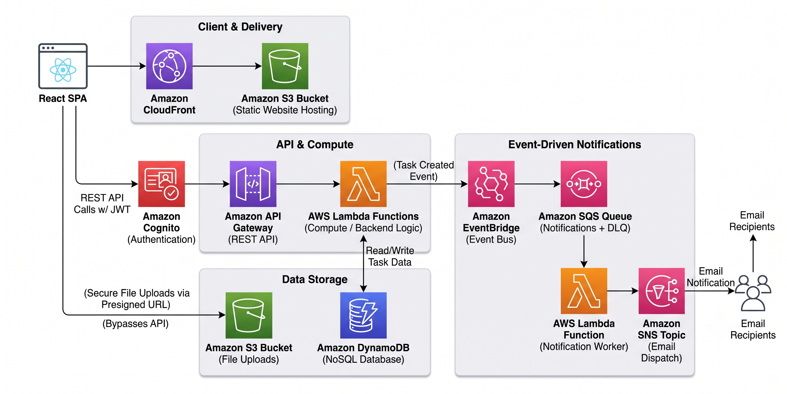

# TaskFlow

An enterprise-grade, multi-tenant project management platform built entirely on an event-driven AWS Serverless architecture.


## 2. Introduction

Modern teams use multiple disconnected tools for planning, collaboration, and tracking work. This creates fragmented workflows, lost files, and poor visibility into team progress. 

TaskFlow unifies project planning, Kanban boards, file management, and real-time collaboration into a single, highly responsive platform. Built to demonstrate production-grade cloud engineering, it leverages a fully serverless, event-driven architecture using 10 core AWS services. This ensures zero-maintenance scaling, single-digit millisecond data queries, and decoupled asynchronous workflows.

## 3. Features

### Workspace & Identity Management
- **Multi-Tenant Workspaces:** Create and seamlessly switch between multiple team workspaces.
- **Member Invitations:** Invite teammates via email, resolved directly through Amazon Cognito's user directory.
- **Secure Authentication:** JWT-based user authentication and API authorization via Amazon Cognito.

### Task Management (Optimistic UI)
- **Kanban Boards:** Interactive drag-and-drop boards (To Do, In Progress, Done) with instant optimistic UI updates.
- **Rich Task Details:** Track assignees, priority levels, due dates (with overdue highlighting), and task descriptions.
- **Real-Time Collaboration:** Threaded task comments sorted automatically by timestamp using NoSQL compound keys.

### Files & Analytics
- **Direct-to-S3 Uploads:** Secure, temporary pre-signed URLs allow the browser to upload files directly to S3, bypassing backend compute entirely.
- **Live Dashboard:** Client-side data visualization (Pie and Bar charts) for task distributions by status and priority.

### Event-Driven Notifications
- **Decoupled Pipeline:** Task creation events fan out through EventBridge to an SQS Queue, processed asynchronously by a worker Lambda to send emails via SNS.

## 4. Screenshots

| Landing Page | Kanban Board |
|-----------|--------------|
|  |  |

| Analytics Dashboard | Task Details & Comments |
|-------------------------|-----------------|
|  |  |

## 5. Live Demo

- **Frontend Application:** [https://tasks.samarth-patel.dev](https://tasks.samarth-patel.dev) *(Replace with your domain)*
- **Watch the 60-second Walkthrough:** [Demo Video Link](#)

## 6. Architecture Diagram



## 7. Tech Stack

| Layer | Technology |
|-------|------------|
| **Frontend Framework** | React, Vite, React Router v6 |
| **UI Components** | `@hello-pangea/dnd` (Drag & Drop), Recharts, Lucide Icons, React Hot Toast |
| **Compute / Backend** | AWS Lambda (Node.js 20.x) - 11 unique functions |
| **Database** | Amazon DynamoDB (NoSQL) |
| **Authentication** | Amazon Cognito + `@aws-amplify/ui-react` |
| **Static Hosting & CDN** | Amazon S3 + Amazon CloudFront (with ACM custom domain) |
| **File Storage**| Amazon S3 (CORS enabled, Pre-signed URLs) |
| **Event Routing** | Amazon EventBridge |
| **Asynchronous Jobs** | Amazon SQS (with Dead Letter Queues) |
| **Notifications** | Amazon SNS |
| **API Routing** | Amazon API Gateway (Lambda Proxy Integration) |
| **Monitoring** | Amazon CloudWatch (Logs, Custom Metrics, Alarms) |
| **CI/CD** | GitHub Actions |

## 8. Folder Structure

```text
frontend/
├── src/
│   ├── api.js                # Centralized authed fetch wrapper for all API calls
│   ├── index.css             # Global design system (colors, typography, spacing)
│   ├── main.jsx              # Entry point, Amplify Auth config, Router setup
│   ├── App.jsx               # Route definitions
│   ├── context/
│   │   └── WorkspaceContext.jsx # Shared global state for current workspace
│   ├── components/           # Reusable UI (AppShell, TaskCard, TaskModal)
│   └── pages/                # Route views (LandingPage, Board, Dashboard, Files, Members)
├── .github/workflows/
│   └── deploy.yml            # CI/CD pipeline definition
└── .env                      # Environment variables
```

## 9. Getting Started

### Requirements
- Node.js 20+
- AWS CLI (Configured with IAM credentials for deployment)
- Git

### Local Installation

```bash
git clone https://github.com/samarth-patel/aws-task-management.git
cd aws-task-management/frontend
npm install
```

### Environment Variables
Create a `.env` file in the `frontend/` directory.

| Variable | Description |
|----------|-------------|
| `VITE_API_URL` | Your AWS API Gateway Invoke URL |
| `VITE_USER_POOL_ID` | Amazon Cognito User Pool ID |
| `VITE_USER_POOL_CLIENT_ID` | Amazon Cognito App Client ID |

### Run Locally
```bash
npm run dev
```

## 10. Database Schema (DynamoDB)

The database is heavily optimized for fast read access using NoSQL access patterns.

### Tables & Indexes
1. **Users Table**
   - Partition Key: `UserID`
2. **Workspaces Table**
   - Partition Key: `WorkspaceID`
3. **WorkspaceMembers Table (Mapping Table)**
   - Resolves the many-to-many relationship for O(1) queries.
   - Partition Key: `UserID`, Sort Key: `WorkspaceID` (Gets all workspaces for a user)
   - **GSI:** `WorkspaceID-index` - Partition Key: `WorkspaceID` (Gets all members of a workspace)
4. **Tasks Table**
   - Partition Key: `WorkspaceID`, Sort Key: `TaskID`
   - **GSI:** `AssigneeID-DueDate-index` - Partition Key: `AssigneeID`, Sort Key: `DueDate`
5. **Comments Table**
   - Partition Key: `TaskID`, Sort Key: `CommentID`
   - *Design Pattern:* `CommentID` is constructed as `[ISO-Timestamp]#[UUID]`. Because DynamoDB automatically sorts by the Sort Key, this guarantees chronological comment retrieval without expensive in-memory sorting.

## 11. System Design Deep Dives

### Pre-Signed URL File Uploads
Instead of piping binary file data through API Gateway and Lambda (which is slow, expensive, and subject to payload limits), the frontend requests a temporary **Pre-signed URL** from Lambda via the `@aws-sdk/s3-request-presigner` package. The frontend then issues an HTTP PUT directly to S3.

### Optimistic UI Updates
When a user drags a task on the Kanban board to a new column, the React state is updated instantly, making the UI feel incredibly snappy. The API call (`PUT /tasks/{id}`) happens asynchronously in the background. If the request fails, the UI gracefully rolls the card back to its original column.

### Event-Driven Notifications
When a task is created, the `CreateTask` Lambda doesn't block the API response to send an email. Instead, it writes to DynamoDB and fires a lightweight `TaskCreated` event to EventBridge. EventBridge routes this to an SQS Queue. A separate Worker Lambda consumes the queue in batches and triggers Amazon SNS to dispatch emails. If a notification fails, it automatically routes to a Dead Letter Queue (DLQ) for debugging.

## 12. CI/CD & Deployment

Every push to the `main` branch triggers a **GitHub Actions** workflow that:
1. Installs Node.js dependencies.
2. Builds the Vite React application injecting production `.env` variables.
3. Syncs the compiled `dist/` directory directly to the Amazon S3 static hosting bucket.
4. Triggers a CloudFront cache invalidation so global edge locations immediately serve the newest version.

## 13. Security Considerations
- **API Authentication:** Amazon Cognito Authorizer validates JWT tokens directly at the API Gateway layer.
- **Data Isolation:** Lambdas extract the user's `sub` (Cognito ID) from the API Gateway event context, preventing users from spoofing IDs in request bodies to access unauthorized workspaces.
- **S3 CORS & Private Buckets:** The frontend hosting bucket blocks all public access and is strictly served through CloudFront via Origin Access Control (OAC). The file storage bucket strictly scopes CORS to the production domain.

## 14. License
Distributed under the MIT License. See `LICENSE` for more information.

## 15. Author
**Samarth Patel**
- [Portfolio](https://samarth-patel.dev)
- [LinkedIn](#)
- [GitHub](#)
